<h1 align="center">Night Wayfarer</h1>

  

  <em>Backend & Frontend developer. Reliable systems, clean interfaces.</em>

  
  
  

---

### О себе

- Разрабатываю **бэкенд и фронтенд**, ценю надёжность и чистые интерфейсы.
- Ночной странник: код, музыка, игры, путешествия.
- Строю системы, которые работают предсказуемо и не подводят.

---

### Стек

  
  
  
  
  
  
  

> Замени список на свои реальные технологии.

---

### GitHub Stats

  
  

---

  <em>Wandering through code, one night at a time.</em>

